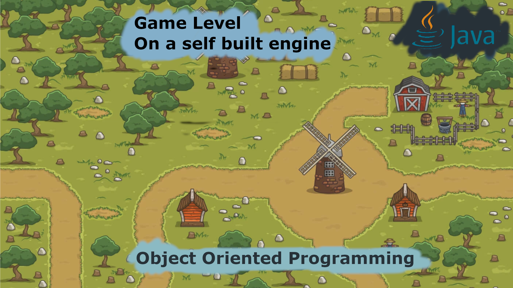

<p align="center">

</p>

# CSC130 Data Structures - Game Project

## Table of Contents
- [Overview](#overview)
- [Features](#features)
- [File Structure](#file-structure)
- [How to Play](#how-to-play)
- [Checkpoints](#checkpoints)
- [Error Handling](#error-handling)
- [Contributing](#contributing)
- [Contact](#contact)
 
This project was developed as part of the CSC130 Data Structures course at California State University, Sacramento. The primary goal was to apply various data structure concepts to a game development framework. The project builds on a game engine provided by Professor Matthew Phillips and was completed through several checkpoints throughout the semester, each introducing a new data structure.

## Overview
This game is built using a Java-based game engine that was built by me throughout the semester. Over the course, we integrated different data structures to enhance the game's functionality, performance, and gameplay elements.

## Features
- ***Real-time Animation:*** Various character states such as idle, running, and jumping, represented with animations.
- ***Interactive Environment:*** Objects like trees, beds, and chairs are part of the game world.
- ***Data Structure Integration:*** Core concepts such as arrays, linked lists, and queues were implemented to manage game elements such as animations, game objects, and inputs.

## File Structure
```
Art/:                           //Contains all the visual assets (animations, sprites, backgrounds).
    f0.png:                     //Initial animation state
    idleRight. png:             //Idle animation when facing right
    fr1-fr8.png:                //Running animations facing right
    idleLeft.png:               //Idle animation when facing left
                                //More assets for various actions and directions...
bin/:                           //Contains compiled code and necessary binaries.
    Data/:                      //Handles game data storage.
    FileIO/:                    //Manages file input/output.
    GameLoop/:                  //Controls the main game loop and timing.
    Graphics/:                  //Renders the game elements and assets.
    Input/:                     //Handles user input through keyboard or other devices.
    Logic/:                     //Contains game logic and behavior of objects and characters.
    Main/:                      //Initializes the game and sets up the environment.
    Timer/:                     //Manages time-related events and delays.
```
## How To Play
1. Launch the game through the main executable or IDE.
2. Use the arrow keys to move the player character.
3. Interact with the environment by standing next to objects like trees, TVs, chairs, etc.
4. Explore the game world while completing different objectives.

## Checkpoints 
Throughout the course, each checkpoint introduced a new challenge:

***Checkpoint 1:*** Implemented arrays to handle the player's movement and game objects.
***Checkpoint 2:*** Used linked lists for managing multiple game states.
***Checkpoint 3:*** Implemented stacks and queues for managing game events.
***Checkpoint 4:*** Optimized the game logic using hash maps for collision detection.

## Error Handling
The game engine includes several error-checking mechanisms:
- ***Invalid Input:*** Handles incorrect user inputs with friendly error messages.
- ***File Errors:*** Catches file-related errors (missing assets, corrupt data).
- ***Null References:*** Avoids null pointer exceptions through checks in critical sections of the code.
  
## Contributing
Contributions are welcome! Feel free to fork this repository, make your changes, and submit a pull request.


## Contact
If you have any questions or suggestions, feel free to contact me at:  

**Vadym Kharchenko**  
Email: vadym.kharchenko@yahoo.com
  
